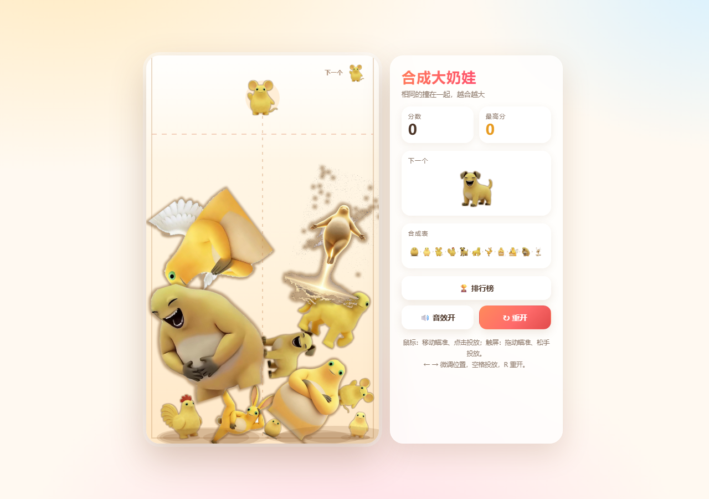

# 合成大奶娃 

纯 **HTML + CSS + JavaScript** 的静态网页小游戏，零依赖、零构建、离线可玩。

## 玩法

- **鼠标**：移动瞄准，点击即投放。
- **触屏**：按住拖动瞄准，**松手才投放**——手指不会挡住落点，也方便微调。
- 棋盘右上角的「下一个」是**下一颗**；当前这颗画在准星位置（虚线顶端）。
  投放后的冷却期间当前这颗会**变淡**显示（还不能投），这样两个位置始终各是各的，不会看混。
- 两个**同级别**的碰到一起就合成为高一级，并获得分数。
- 顶上虚线是**警戒线**：有水果**卡在线的上方并且基本停住**、累计超过 1.5 秒即判负
  （被弹起来飞过线的不算，详见下面的「失败规则」）。
- 结束后**自动上榜**（进不了前 20 就不提交）；没填昵称就记作「默认用户」，
  昵称随时可以在排行榜弹窗里改。
- `←` `→` 微调位置，`Space` / `Enter` 投放，`R` 重新开始。
  （结束后空格/回车不再重开，避免手快连开新局。）

## 参考的开源项目

本项目的玩法与水果链设计参考了以下开源实现

- [Ikapricity/daxigua](https://github.com/Ikapricity/daxigua) — 合成大西瓜未修改版本源码，可直接在浏览器运行
- [CaptainAries/dxg](https://github.com/CaptainAries/dxg)
- [moonfloof/suika-game](https://github.com/moonfloof/suika-game) — 使用 matter.js 的英文版克隆
- [IceburgLettuce17/suika-game-js-beta](https://github.com/IceburgLettuce17/suika-game-js-beta)

## 许可

仅供学习娱乐使用。
